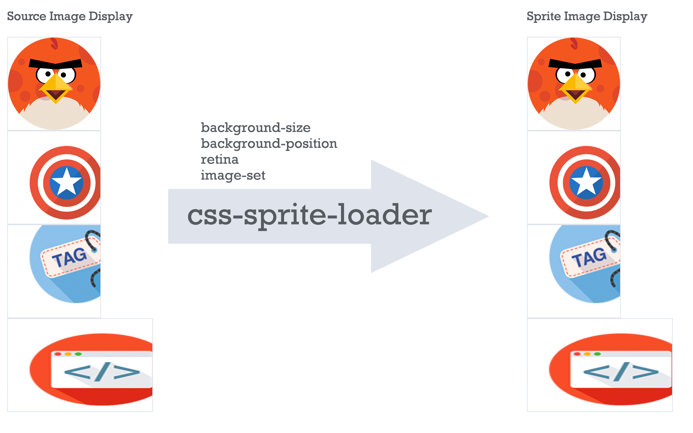

# css-sprite-loader

- [README in English](README.md)

这是一款可以自动将 PNG 图片合并成雪碧图的 Webpack loader。



## 示例

给需要合并的背景图添加 sprite 后缀参数：

``` css
.foo {
    background: url('../images/gift.png?sprite');
}
```

css-sprite-loader 会自动生成雪碧图：

``` css
.foo {
    background: url(dest/sprite.png?5d40e339682970eb14baf6110a83ddde) -100px 0 no-repeat;
}
```

## 特性

与别的类似的雪碧图加载器不同的是：

- 通过路径参数可以很轻松地决定是否使用雪碧图。
- 全面支持 CSS 的`background`属性，包括`background-position`、`background-size`等。保证处理前后效果一致。例如：

``` css
.bg-position-and-size {
    width: 100px;
    height: 150px;
    background: url('../images/html.png?sprite') 30px 20px no-repeat;
    background-size: 100%;
}
```

会重新自动计算位置和大小，转换成

``` css
.bg-position-and-size {
    width: 100px;
    height: 150px;
    background: url('dest/sprite.png?dc5323f7f35c65a3d6c7f253dcc07bad') -101.25px -111.25px / 231px 231px no-repeat;
}
```

> **注意**：
> - 使用`background-position`，必须用像素值，且位置为左上；
> - 使用`background-size`时，推荐在同一个块中指定像素值的`width`和`height`属性，loader 会按这两个值计算。否则会以图片本身的大小计算（这是种猜测，可能会与原始情况有偏差）

- 提供 retina 和 image-set 两种方式，用于解决高分辨率图片的问题，参见下文[retina](#retina2x-retina3x-retina4x-) 和 [image-set](#image-set)。

## 安装

``` shell
npm install --save-dev css-sprite-loader
```

## 配置

除了在 Webpack 配置中添加 loader，还需要添加 Plugin。

``` javascript
const CSSSpritePlugin = require('css-sprite-loader').Plugin;

module.exports = {
    ...
    module: {
        rules: [{ test: /\.css$/, use: ['style-loader', 'css-loader', 'css-sprite-loader'] }],
    },
    plugins: [new CSSSpritePlugin()],
};
```

### background 属性的选项

#### sprite 参数

是否将当前的图片打入雪碧图，或指定打入哪个雪碧图。例如：

``` css
.foo {
    background: url('../images/gift.png?sprite');
}

.bar {
    background: url('../images/light.png?sprite=sprite-nav');
}
```

以上图片将会被打入两个雪碧图中：

``` css
.foo {
    background: url('dest/sprite.png?fee16babb11468e0724c07bd3cf2f4cf');
}

.bar {
    background: url('dest/sprite-nav.png?56d33b3ab0389c5b349cec93380b7ceb');
}
```

#### retina@2x, retina@3x, retina@4x, ...

是否支持某种分辨率的 retina 图片。比如你的 images 目录中有以下文件：

```
images/
    angry-birds.png
    angry-birds@2x.png
    angry-birds@4x.png
```

那么你的 CSS 可以写成如下格式：

``` css
.baz {
    width: 128px;
    height: 128px;
    background: url('../images/retina/angry-birds.png?sprite&retina@2x&retina@4x');
    background-size: 100%;
}
```

会转换为

``` css
.baz {
    width: 128px;
    height: 128px;
    background: url('dest/sprite.png?369108fb0a164b04ee10def7ed6d4226') -296px 0 / 424px 424px no-repeat;
}

@media (-webkit-min-device-pixel-ratio: 2), (min-resolution: 2dppx) {
    .baz {
        background: url('dest/sprite@2x.png?51d951f98092152d8fc56bf3380577e3') -148px 0 / 276px 128px no-repeat;
    }
}

@media (-webkit-min-device-pixel-ratio: 4), (min-resolution: 4dppx) {
    .baz {
        background: url('dest/sprite@4x.png?4a6a7dbace7933efe321b357d4db2fb9') 30px 20px / 213px 102px no-repeat;
    }
}
```

你也可以将@2x作为默认分辨率：

```
images/
    angry-birds@1x.png
    angry-birds@2x.png
    angry-birds@4x.png
```

``` css
.baz {
    width: 128px;
    height: 128px;
    background: url('../images/retina/angry-birds@2x.png?sprite&retina@1x&retina@4x');
    background-size: 100%;
}
```

会转换为

``` css
.baz {
    width: 128px;
    height: 128px;
    background: url('dest/sprite.png?369108fb0a164b04ee10def7ed6d4226') 0 0 / 212px 212px no-repeat;
}

@media (-webkit-max-device-pixel-ratio: 1), (max-resolution: 1dppx) {
    .baz {
        background: url('dest/sprite@1x.png?e5cf95daa8d2c40e290009620b13fba3') 0 0 / 128px 128px no-repeat;
    }
}

@media (-webkit-min-device-pixel-ratio: 4), (min-resolution: 4dppx) {
    .baz {
        background: url('dest/sprite@4x.png?4a6a7dbace7933efe321b357d4db2fb9') 30px 20px / 213px 102px no-repeat;
    }
}
```

> **注意**：
> 这里的`retina@1x`对应的原始图片路径要显式命名为`xxx@1x`，最后会被打入到`sprite@1x`当中。

#### image-set function

也可以用 image-set 函数来设置不同分辨率的 retina 图片。

image-set 函数这一特性目前处于[Stage 2](https://www.w3.org/TR/css-images-4/#image-set-notation)，[浏览器的兼容情况](https://developer.mozilla.org/en-US/docs/Web/CSS/image-set#Browser_compatibility)在这里，但我们用 PostCSS 做了支持。

> **注意**：
> 要使用这个特性，在 css-sprite-loader 之前不能提前将 image-set 做降级处理。例如之前有`postcss-preset-env`，可以将它的选项设置为：
> ``` js
> {
>     features: {
>         'image-set-function': false,
>     },
> }
> ```

比如你的 images 目录中有以下文件：

```
images/
    angry-birds.png
    angry-birds@2x.png
    angry-birds@4x.png
```

那么你的 CSS 可以写成如下格式：

``` css
.baz {
    width: 128px;
    height: 128px;
    background: image-set('../images/retina/angry-birds.png?sprite' 1x, '../images/retina/angry-birds@2x.png?sprite' 2x);
    background-size: 100%;
}
```

会转换为

``` css
.baz {
    width: 128px;
    height: 128px;
    background: url('dest/sprite.png?369108fb0a164b04ee10def7ed6d4226') 0 0 / 212px 212px no-repeat;
}

@media (-webkit-min-device-pixel-ratio: 2), (min-resolution: 2dppx) {
    .baz {
        background: url('dest/sprite@2x.png?51d951f98092152d8fc56bf3380577e3') -148px 0 / 276px 128px no-repeat;
    }
}
```

如果有需要，也可以指定高分辨率图不打包、或指定在不同的分组。

``` css
.baz {
    width: 128px;
    height: 128px;
    background: image-set(
        '../images/retina/angry-birds.png?sprite' 1x,
        '../images/retina/angry-birds@2x.png?sprite-nav' 2x,
        '../images/retina/angry-birds@4x.png' 4x,
    );
    background-size: 100%;
}
```

会转换为

``` css
.baz {
    width: 128px;
    height: 128px;
    background: url('dest/sprite.png?e5cf95daa8d2c40e290009620b13fba3') 0 0 / 212px 212px no-repeat;
}

@media (-webkit-min-device-pixel-ratio: 2), (min-resolution: 2dppx) {
    .baz {
        background: url('dest/sprite-nav@2x.png?369108fb0a164b04ee10def7ed6d4226') -148px 0 / 276px 128px no-repeat;
    }
}

@media (-webkit-min-device-pixel-ratio: 4), (min-resolution: 4dppx) {
    .baz {
        background: url('dest/angry-birds@4x?4a6a7dbace7933efe321b357d4db2fb9') no-repeat;
    }
}
```

### loader 参数

暂无。

### plugin 参数

#### defaultName

默认雪碧图分组名

- Type: `string`
- Default: `sprite`

#### filename

用于设置生成文件名的模板，类似于 Webpack 的 output.filename。模板支持以下占位符：

- `[ext]` 生成资源文件后缀
- `[name]` 分组名
- `[hash]` 生成文件中 svg 文件的 hash 值（默认使用16进制 md5 hash，所有文件使用 svg 的 hash，其他文件的 hash 有时会发生改变）
- `[<hashType>:hash:<digestType>:<length>]` 生成 hash 的样式
    - `hashType` hash 类型，比如：`sha1`, `md5`, `sha256`, `sha512`
    - `digestType` 数字进制：`hex`, `base26`, `base32`, `base36`, `base49`, `base52`, `base58`, `base62`, `base64`
    - `length` 字符长度


- Type: `string`
- Default: `'[name].[ext]?[hash]'`

#### output

生成的图片文件相对于 webpack 的 output 的相对路径。**必须是一个相对路径。**

- Type: `string`
- Default: `'./'`

#### publicPath

图片在 CSS url 中的路径，与 Webpack 的 publicPath 相同，此选项用于覆盖它。

- Type: `string`
- Default: `''`

#### padding

雪碧图中小图片之间的间距

- Type: `number`
- Default: `'sprite'`

#### filter

如何筛选参与合并雪碧图的小图片文件，可选值：`'all'`、`'query'`、`RegExp`

- `'all'`: 所有被引用的小图片都要被合并
- `'query'`: 只有在路径中添加了`?sprite`后缀参数的小图片才会被合并
- `RegExp`: 根据正则表达式来匹配路径

- Type: `string`
- Default: `'query'`

#### queryParam

自定义路径中的后缀参数 key，当`filter: 'query'`才生效。

- Type: `string`
- Default: `'sprite'`

#### imageSetFallback

是否对不需要走雪碧图流程的`image-set`也做降级处理。因为部分浏览器已经支持`-webkit-image-set`，可能不需要做降级处理。

- Type: `boolean`
- Default: `false`


#### plugins

处理完雪碧图之后，运行 postcss 的插件列表。这些插件不会处理整个文件，只会处理与雪碧图相同的几行代码。比如使用一些单位转换的插件`require('postcss-px-to-viewport')`。

- Type: `Array`
- Default: `[]`

## 修改日志

参见[Releases](https://github.com/vusion/css-sprite-loader/releases)

## 贡献指南

参见[Contributing Guide](https://github.com/vusion/DOCUMENTATION/issues/4)

## 开源协议

[MIT](LICENSE)

